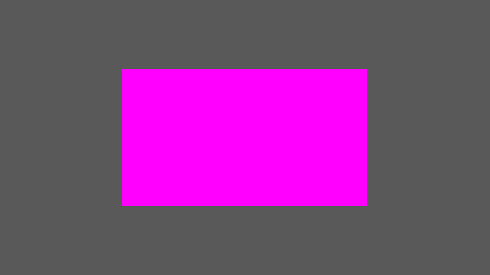

# Speed Run A Rectangle

There are a few things we need to do before we can start rendering triangles, the meatiest of which is shader compilation. There are many ways to get triangles onto the screen in modern OpenGL but all of them require shaders so we will start there.

## Shaders

To render triangles in modern OpenGL at least one shader program is required. 

<details>
<summary>What's a shader program?</summary>
	
A shader program in opengl is an assembly of one or more 'shaders' which are 'linked' together. 

Shaders are pieces of code that are sent to and execute on the GPU to perform different functions within a pipeline. They are where the bulk of your customisability comes from in your rendering pipeline.

You can read details on [the Khronos OpenGL wiki](https://www.khronos.org/opengl/wiki/Shader).
</details>


To get started we'll need two shaders: a vertex shader, a fragment shader, and some boilerplate for compiling these two shaders and linking them into a 'program'.

For the sake of getting something rendering quickly I will not start with the typical 'hello world' that most tutorials start with, but with something a little more advanced so we can skip some of the other boilerplate we'd normally need.

Try to follow if you can, but if you don't understand it right away don't worry. Understanding can come once we have something to look at.


### The Vertex Shader

Lets start at the start of the pipeline, the vertex shader - a small program that is run for each vertex we want to render. We have some creative liberty as to what constitutes a 'vertex' here, but for now lets just start with code:

```c
{{#include ../../examples/ch01/src/shaders/vert.glsl}}
```

This shader will generate the vertices we need to render two triangles.

This shader is a little unusual but hopefully should be small enough to follow. To fully understand it however, you need to be aware of two special variables: 
- [`gl_VertexID`](https://registry.khronos.org/OpenGL-Refpages/gl4/html/gl_VertexID.xhtml): Holds the vertex index. When used with `glDrawArrays(_, _, num_vertices)`, will hold a value between zero and `num_vertices`.
- [`gl_Position`](https://registry.khronos.org/OpenGL-Refpages/gl4/html/gl_Position.xhtml): The output of the vertex shader. The final position of our vertex (in [clip space](https://www.khronos.org/opengl/wiki/Vertex_Post-Processing#Clipping)) should be written here.

See <https://www.khronos.org/opengl/wiki/Vertex_Shader> for more detail.


### The Fragment Shader

Next the fragment shader - a program that is run for each [fragment](https://www.khronos.org/opengl/wiki/Fragment) (opengl speak for "maybe a pixel but not quite") and determines (among other things) the colour to be written to the backbuffer.
We will be using this shader for now:

```c
{{#include ../../examples/ch01/src/shaders/frag.glsl}}
```

This shader will write magenta to the backbuffer for each fragment generated during rasterisation - or put more simply, our triangles will be pink.

`out vec4 o_color;` specifies an output for the shader. The name can be anything, only its type and the fact that it is an output matters. Whatever we write to this variable during an invocation of this shader will be (potentially) written to the backbuffer.

This shader will become more involved later, but for now it will do.

See <https://www.khronos.org/opengl/wiki/Fragment_Shader> for more detail.


### Shader Compilation

This part is a bit gnarly, but its something that only needs to be done once.
Shader compilation is not _complex_, just messy due to the error checking required, and messier still due to needing to deal with nul terminated strings thanks to OpenGL being designed for C.

That said, the process for compiling shaders can be summarised as such:
- For each desired shader,
	- Create a shader object - [`glCreateShader`](https://registry.khronos.org/OpenGL-Refpages/gl4/html/glCreateShader.xhtml)
	- Pass its source code to OpenGL - [`glShaderSource`](https://registry.khronos.org/OpenGL-Refpages/gl4/html/glShaderSource.xhtml)
	- Compile it - [`glCompileShader`](https://registry.khronos.org/OpenGL-Refpages/gl4/html/glCompileShader.xhtml)
	- Check for errors, and bail if any are encountered
- Create a shader program - [`glCreateProgram`](https://registry.khronos.org/OpenGL-Refpages/gl4/html/glCreateProgram.xhtml)
- Attach every shader to the program - [`glAttachShader`](https://registry.khronos.org/OpenGL-Refpages/gl4/html/glAttachShader.xhtml)
- Finally link the program - [`glLinkProgram`](https://registry.khronos.org/OpenGL-Refpages/gl4/html/glLinkProgram.xhtml), and
- Check for errors

After this, assuming no errors, you will have a usable program.
Though it is worth noting that once linked, shader objects are no longer required and can be cleaned up.
It can be detached from the program ([`glDetachShader`](https://registry.khronos.org/OpenGL-Refpages/gl4/html/glDetachShader.xhtml)) and optionally deleted ([`glDeleteShader`](https://registry.khronos.org/OpenGL-Refpages/gl4/html/glDeleteShader.xhtml)).

Enough summarising, time for code:
```rust,no_run
{{#rustdoc_include ../../examples/ch01/src/main.rs:compile_shader}}
```
This snippet represents step one of the above process: compiling and error checking an individual shader.

Next we can create a program and start linking:
```rust,no_run
{{#rustdoc_include ../../examples/ch01/src/main.rs:create_shader_program}}
```

check_program_status in the above snippet is very similar to check_shader_status barre some different names
```rust,no_run
{{#rustdoc_include ../../examples/ch01/src/main.rs:check_program_status}}
```

Once this is done you should have a program ready to render with. We only need to do a couple more things before we can get something on screen.


## Finally Rendering?

Rendering our generated, magenta rectangle _should_ now just be a matter of binding our program and emitting the appropriate drawcall. That would look something like this:
```rust,no_run
{{#rustdoc_include ../../examples/ch01/src/main.rs:final_render}}
```

However, if you were to try this now (and you've set up debug callbacks properly) you should get OpenGL complaining at you and refusing to draw anything.

Perhaps it will look something like this:
```
GL ERROR!
Source:   api
Severity: high
Type:     error
Message: GL_INVALID_OPERATION in glDrawArrays
```

Why is that?

Because we are missing one final piece of state - a [Vertex Array Object](https://www.khronos.org/opengl/wiki/Vertex_Specification#Vertex_Array_Object).

<!-- TODO: shorten the below - way too wordy -->

A VAO is an object that more or less describes how to feed vertices to the GPU. It does so via a number of 'vertex attributes'. Each attribute represents a stream of data that describes some aspect of a 'vertex' (or an instance), like position, color, uvs, etc. On top of information about attributes, a VAO also potentially contains references to buffers of vertex data and information about to turn them into attributes, _and_ information about _which_ attributes should draw from buffers at all.

This last part is why we need a VAO. We don't have any buffers to draw data from, our vertex shader doesn't have any attributes to feed. _BUT_ `glDrawArrays` _still_ needs to query the VAO to determine _if_ there are any buffers it needs to read. In effect, we just need a VAO that says "no, you don't need to pull data from anywhere, just draw".

Lucky for us this is easy to communicate, as this is the default state of a new VAO.
```rust,no_run
{{#rustdoc_include ../../examples/ch01/src/main.rs:create_dummy_vao}}
```
The above snippet only needs to run once during setup, and that should be enough to allow us to draw.
Normally you'd want to bind your vao just before you draw, but since we only have one its fine to just bind once at startup.
This code is only temporary so don't worry too much about it just yet.

So if you try calling glDrawArrays one more time, you _should_ be presented with something like this:




## More Resources

The Khronos wiki has a lot of decent information and is worth reading through:
- <https://www.khronos.org/opengl/wiki/Shader>
- <https://www.khronos.org/opengl/wiki/Shader_Compilation>
- <https://www.khronos.org/opengl/wiki/Vertex_Shader>
- <https://www.khronos.org/opengl/wiki/Fragment_Shader>

The OpenGL 4.5 Quick Reference Card also contains a reference for GLSL 450 which is worthwhile looking through if you're not already familiar with GLSL
- <https://www.khronos.org/files/opengl45-quick-reference-card.pdf>